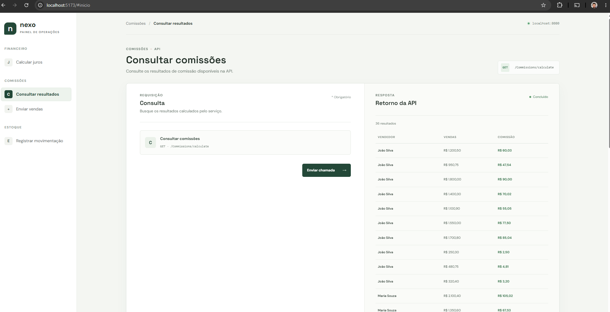

# DesafioTarget

Solução do desafio técnico da Target, composta por uma API em C# (ASP.NET Core) e um frontend em React.

## Estrutura do repositório

| Pasta | Descrição |
|-------|-----------|
| [`DesafioTarget`](./DesafioTarget) | API em ASP.NET Core |
| [`DesafioTarget.Tests`](./DesafioTarget.Tests) | Testes unitários (xUnit) |
| [`Frontend`](./Frontend) | Interface em React |

## Como executar

As instruções de instalação, configuração e execução estão no README de cada projeto:

- [API](./DesafioTarget/README.md)
- [Testes](./DesafioTarget.Tests/README.md)
- [Frontend](./Frontend/README.md)